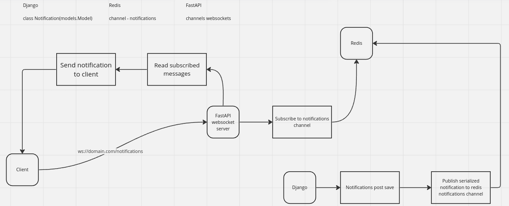
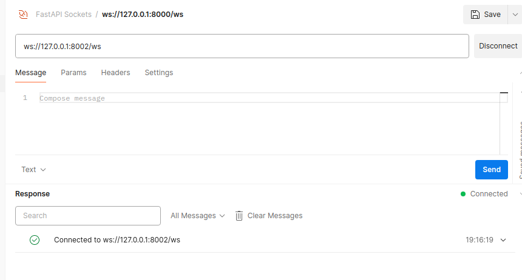
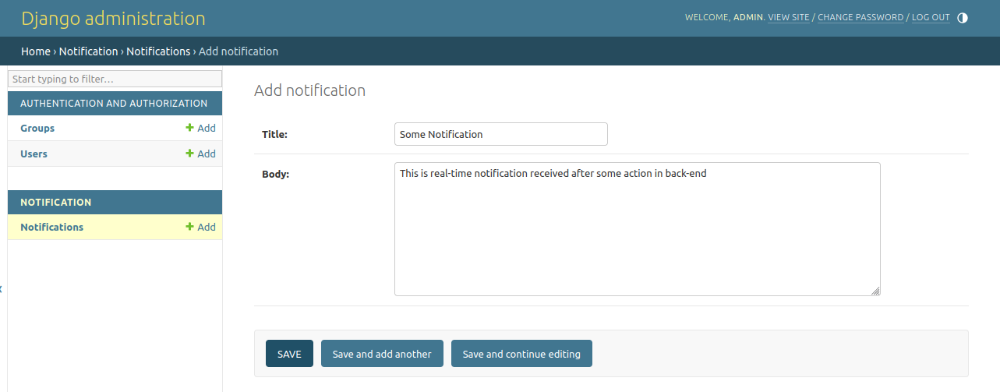
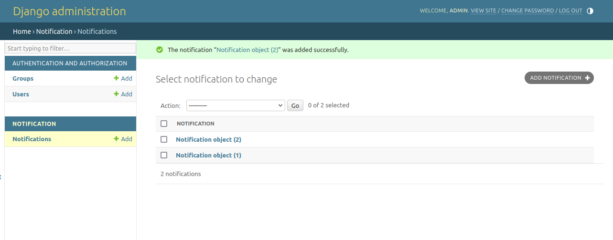
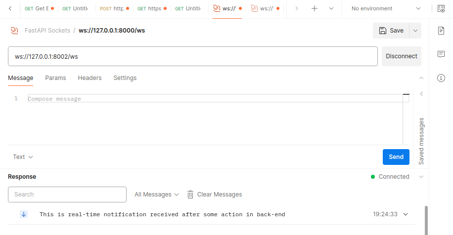

# Pub-Sub

### Project Description

The pub-sub project implements a simple publish-subscribe system in Django and FastAPI, enabling asynchronous communication between multiple clients via a central server using Redis broker.
Project introduces real-time notification delivery when saved to database, notification is sent to all the online (connected) clients to sockets. In practice, it imitates when user is on the website and receives real-time notification about the event which happened.



### Project showcase

Client connects to websocket (Imitates when client joins the website)
- 

Creating notification in django (Imitates when some action happens in back-end. In this case, we want to send notification to all the people who are currently online)

- 

After saving the record in the database, we expect to have real-time notification received in the client side without any delays or pooling

- 

After saving the record we received notification in real-time

- 


## Getting Started


## Features

- **Notifier**: Manages subscriptions and publishes messages to subscribers.
- **Sockets**: Handles network communication between clients and the server.

### Prerequisites

- Docker
- Docker Compose

### Installation and Running

1. Clone the repository:
```bash 
git clone https://github.com/fantozy/pub-sub.git
cd pub-sub
   ```
2. Runing services
```bash 
docker-compose up --build
```
3. Apply migrations 
```bash
docker exec -it pub-sub-notifier python3 manage.py migrate
```
4. Enjoy
